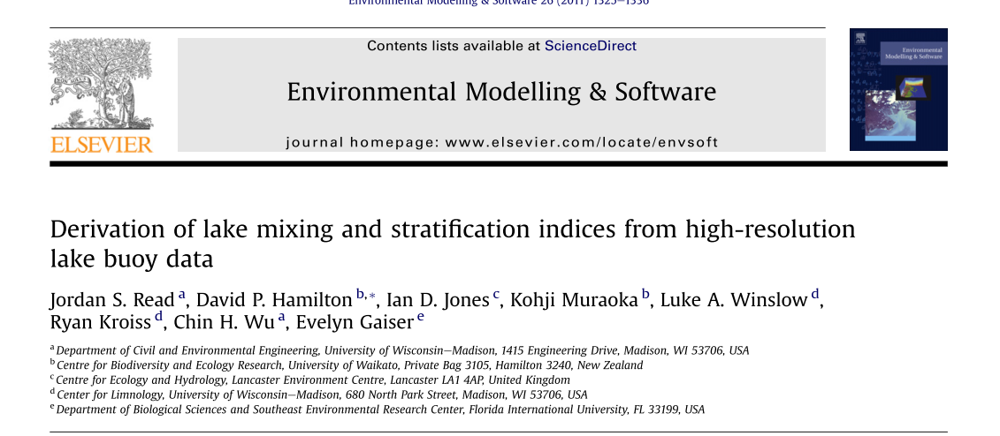
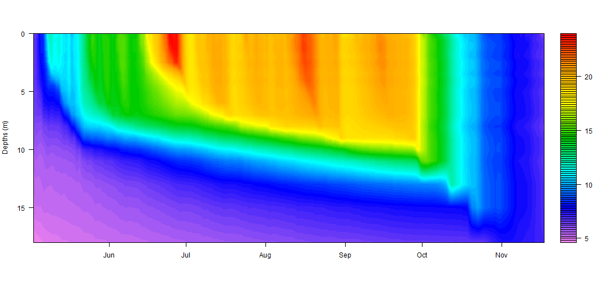
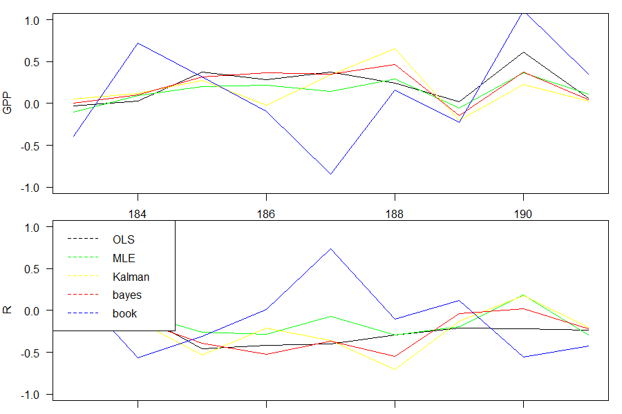
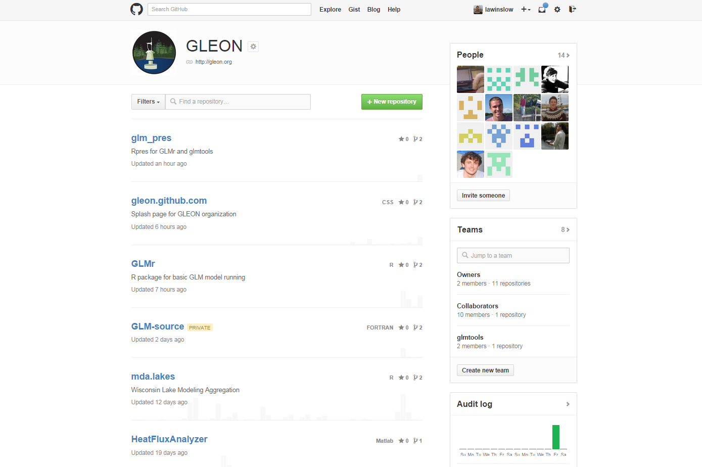
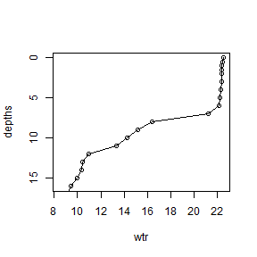
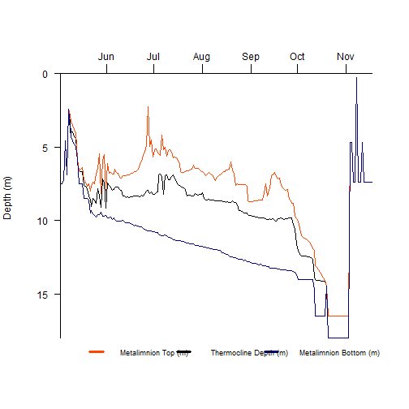

GSA Workshop G16
========================================================
author: Luke Winslow, Jordan Read, GLEON Fellows
date: 2014-10-27

Open source science tools in GLEON
========================================================
**rLakeAnalyzer**

Standardized methods for calculating common important derived physical features of lakes.

**LakeMetabolizer**

A collection of tools for the calculation of freewater metabolism.

rLakeAnalyzer Acknowledgements
========================================================

- [**Derivation of lake mixing and stratification indices from high-resolution lake buoy data**](http://www.sciencedirect.com/science/article/pii/S136481521100123X) (Read, Jordan, Hamilton, David, Jones, Ian, Muraoka, Kohji, Kroiss, Ryan, Wu, Chin, Gaiser, Evelyn)
- Jennie Brentrup for the idea
- **R Package Collaborators:** Jordan Read, Richard Woolway, Jennifer Brentrup, Taylor Leach, Jake Zwart



LakeMetabolizer Acknowledgements
========================================================

- **Multiple models of lake metabolism calculation based on diverse statistical underpinnings** (In Prep) Luke A Winslow, Jacob A. Zwart, Ryan D. Batt, Hilary Dugan, R. Iestyn Woolway, Jessica Corman, Paul C Hanson, Aline Jaimes, Jordan S Read

- GLEON Fellows and Fellowship leadership

Learning Goals
========================================================
1. Become familiar with open-source R tools for Limnology
  * What they do
  * Where to get them
  * How to get started

2. Learn open and collaborative development
  * Where we work together
  * How to contribute

Where to get the packages
========================================================
-Available on [CRAN](http://cran.r-project.org/web/packages/available_packages_by_name.html)


```r
install.packages('rLakeAnalyzer')
install.packages('LakeMetabolizer')
```


```r
library(rLakeAnalyzer)
library(LakeMetabolizer)
```

What is rLakeAnalyzer
========================================================
R-version of original Lake Analyzer

Lake Physics
 

What is LakeMetabolizer
========================================================
Tools for gas exchange and metabolism estimation


Learning Goals
========================================================
1. Become familiar with open-source R tools for Limnology
  * What they do
  * Where to get them
  * How to get started

2. Learn open and collaborative development
  * **Where and how we work together**
  * How to contribute


GLEON Collaborative Development
========================================================



GLEON Github organization
========================================================
[Online Demo](http://github.com/GLEON)

Learning Goals
========================================================
1. Become familiar with open-source R tools for Limnology
  * What they do
  * Where to get them
  * How to get started

2. Learn open and collaborative development
  * Where and how we work together
  * **How to contribute**

Everyone can contribute
========================================================
1. Sign-up for free Github account
2. Go to [http://github.com/GLEON/gsa_workshop](http://github.com/GLEON/gsa_workshop)
3. Create a new "Issue"
  * What is your goal for G16
4. Look through the created issues and comment on one. 

All projects need help...
========================================================
1. Testing
2. Coding
3. Writing examples
4. Writing documentation
5. Creating visualizations
6. ...

Learning Goals
========================================================
1. Become familiar with open-source R tools for Limnology
  * **What they do**
  * Where to get them
  * How to get started

2. Learn open and collaborative development
  * Where and how we work together
  * How to contribute


thermo.depth
========================================================

```r
wtr = c(22.51,22.42,22.4,22.4,22.4,22.36,
        22.3, 22.21, 22.11, 21.23, 16.42, 
		15.15,14.24,13.35,10.94,10.43, 
    10.36,9.94,9.45,9.1,8.91,8.58,8.43)
depths = c(0, 0.5, 1, 1.5, 2, 3,4,5,6,7, 
           8, 9, 10, 11, 12,13,14,15,16, 
		  17,18,19,20)
plot(wtr, depths, type='o', ylim=c(16,0))
```



Finding Examples
========================================================

```r
?thermo.depth
```

rLakeAnalyzer Functions
========================================================

These functions operate on single timesteps
  * thermo.depth
  * meta.depths
  * wedderburn.number
  * schmidt.stability
  * lake.number
  * buoyancy.freq

```r
?thermo.depth
```


Timeseries functions
========================================================
All start with "ts.*"

* ts.buoyancy.freq
* ts.lake.number
* ts.meta.depths
* ts.schmidt.stability
* ts.thermo.depth
* ts.wedderburn.number

```r
?thermo.depth
```

Data Loading
========================================================
Use load.ts to load data into proper format

```r
?load.bathy
?load.ts
```


```r
wtr.path <- system.file('extdata', 'Sparkling.wtr', package="rLakeAnalyzer")
wtr = load.ts(wtr.path)
head(wtr[,1:3])
```

```
             datetime wtr_0.0 wtr_0.5
1 2009-05-02 10:00:00   6.555   6.552
2 2009-05-02 10:30:00   6.555   6.505
3 2009-05-02 11:00:00   6.555   6.540
4 2009-05-02 11:30:00   6.745   6.575
5 2009-05-02 12:00:00   6.775   6.575
6 2009-05-02 12:30:00   6.685   6.635
```

File Format
========================================================
File format is important

```r
file.show(wtr.path)
```


```r
fpath <- system.file('extdata', 'Sparkling.bth', package="rLakeAnalyzer")  
sparkling.bathy = load.bathy(fpath)
head(sparkling.bathy)
```

```
  depths    areas
1      0 583054.0
2      1 549139.5
3      2 519084.9
4      3 496773.0
5      4 477533.7
6      5 455936.5
```

Example files
========================================================
File format is important ([See Vignette](http://cran.r-project.org/web/packages/rLakeAnalyzer/vignettes/data.handling.pdf))

```r
fpath
```

```
[1] "C:/Users/lwinslow/Documents/R/win-library/3.1/rLakeAnalyzer/extdata/Sparkling.bth"
```

```r
wtr.path
```

```
[1] "C:/Users/lwinslow/Documents/R/win-library/3.1/rLakeAnalyzer/extdata/Sparkling.wtr"
```


Timeseries functions
========================================================

```r
ts.meta.depths(wtr[1:4,])
```

```
             datetime       top    bottom
1 2009-05-02 10:00:00 0.7583432 0.7583432
2 2009-05-02 10:30:00 7.4634060 7.4634060
3 2009-05-02 11:00:00 7.6274722 7.6274722
4 2009-05-02 11:30:00 0.2500010 0.2500010
```

```r
ts.thermo.depth(wtr[1:4,])
```

```
             datetime thermo.depth
1 2009-05-02 10:00:00    0.7583422
2 2009-05-02 10:30:00    7.4634050
3 2009-05-02 11:00:00    7.6274712
4 2009-05-02 11:30:00    0.2500000
```


Plotting functions
========================================================

```r
wtr.path <- system.file('extdata', 'Sparkling.daily.wtr', package="rLakeAnalyzer")
wtr=load.ts(wtr.path)
wtr.plot.temp(wtr)
```



rLakeAnalyzer
========================================================
For further info see:
* [Derivation of lake mixing and stratification indices from high-resolution lake buoy data](http://www.sciencedirect.com/science/article/pii/S136481521100123X)
* [CRAN Packge page](http://cran.r-project.org/web/packages/rLakeAnalyzer/index.html)
* [Github Page](http://github.com/GLEON/rLakeAnalyzer)

LakeMetabolizer Functions
========================================================
Two main groups
 * k.*
 * metab.*
 * supporting functions


k.* functions
========================================================
Gas Exchange coefficients (timeseries)

* k.cole
* k.crusius
* k.macIntyre
* k.read


```r
?k.cole
```

metab.* functions
========================================================
Metabolism functions (Single day)

* metab.mle
* metab.ols
* metab.bookkeep
* metab.kalman
* metab.bayesian

Contain detailed documentation

"metab"" functions
========================================================

```r
metab
```

Calculates metabolism daily across a timeseries


Code Example
========================================================
<a href="LakeMetabolizer_workshop.R" download>Click to download</a>


Tasks
========================================================
1. Discuss LakeMetabolizer Data Model
2. Go over example code
3. (Challenge 1) Run example code
4. (Challenge 2) Post metabolism figure you made
5. (Challenge 3) Change the k.gas model
6. (Challenge 4) Use Metabolizer on your data


