Lake modeling workshop
========================================================
author: Jordan S Read, Paul C Hanson, Hilary Dugan, Craig Snortheim, Luke A Winslow
font-family: 'Helvetica'
width: 1440
height: 900
**follow along or view later:**
 - gleon.github.io/inspire.html


Goals for Part II of today's workshop
========================================================
- **GLM**: basic understanding of lake model
- **GLMr**: run GLM from R, keep up-to-date version 
- **glmtools**: reproducible model results handling and visualizations
- **What's next?**: linking lake models to catchment hydrology


Lake modeling overview
====================================
type:sub-section
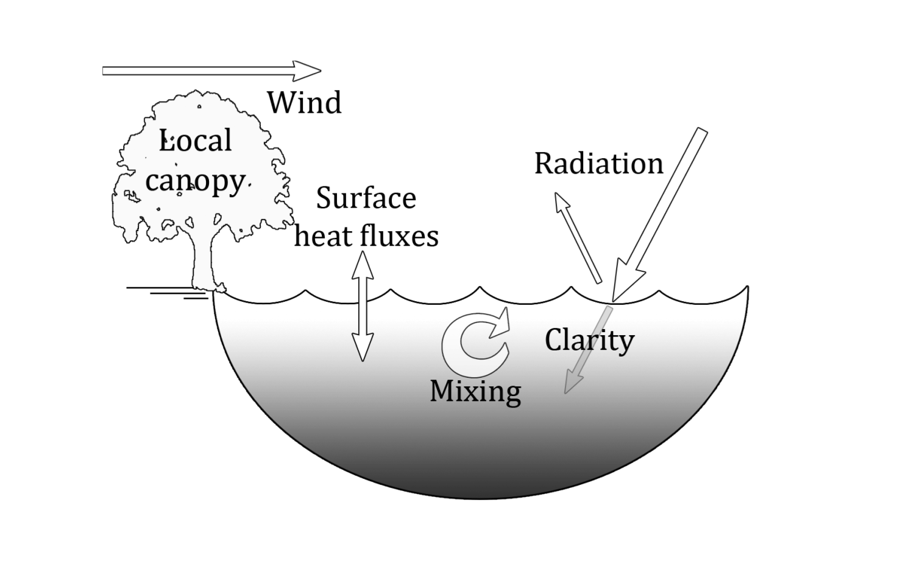

Lake modeling overview
====================================
type:sub-section
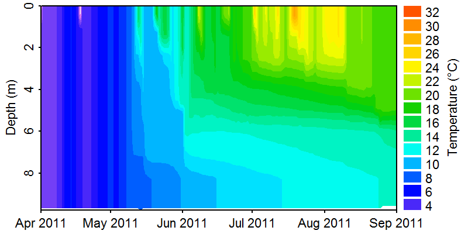

GLM
========================================================
type:section

<div class="indent large">GLM "General Lake Model"</div>
<div class="indent large">Authors: Matthew R Hipsey, Louise C Bruce, David P Hamilton</div>
<div class="indent large">Location: <a target="_blank" title="GLM website" href="http://aed.see.uwa.edu.au/research/models/GLM/">http://aed.see.uwa.edu.au/research/models/GLM/</a></div>

The GLM model has been developed as an initiative of the Global Lake Ecological Observatory Network (GLEON) and in collaboration with the Aquatic Ecosystem Modelling Network (AEMON) that started in 2010. The model was first introduced in Leipzig at the 2nd Lake Ecosystem Modelling Symposium in 2012, and has since developed rapidly with application to numerous lakes within the GLEON network and beyond.

Source code available at
http://github.com/GLEON/GLM-source


GLM overview
====================================
type:sub-section
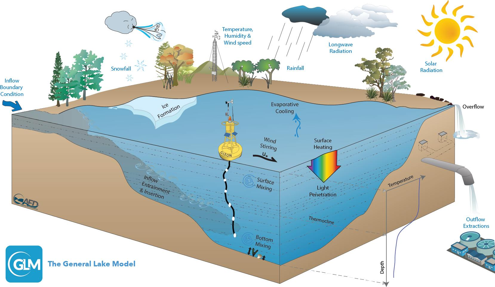

GLM overview
====================================
type:sub-section
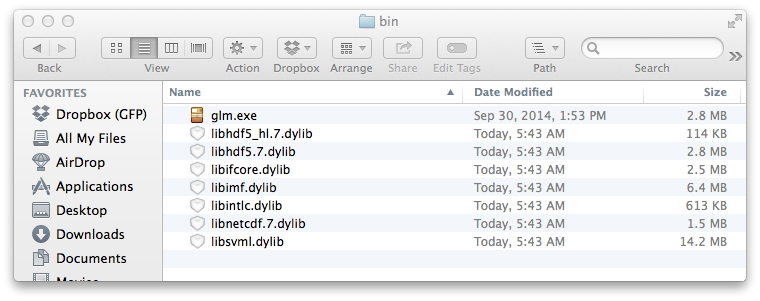

GLM overview
====================================
type:sub-section
left: 50%
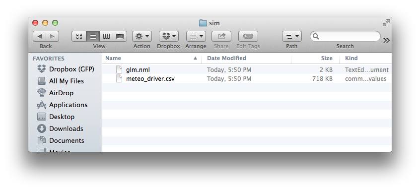
***
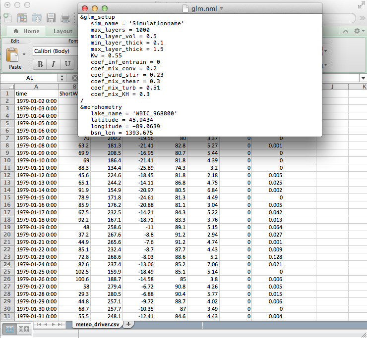


GLM overview
====================================
type:sub-section
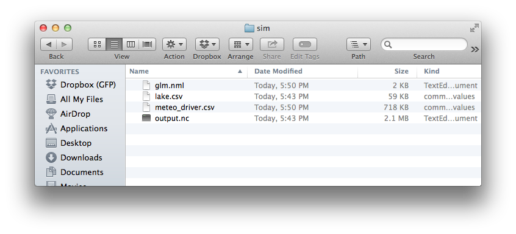

GLM results (Craig)
====================================
type:sub-section


Why R?
========================================================
- **Performace**: stable, light and fast
- **Support network** 
 - documentation, community, developers
- **Reproducibility**
 - anyone anywhere can reproduce results
 - enables dissemination - this presentation is a .Rmd file!
- **Versatility**: unified solution to *almost* any numerical problem, graphical capabilities
- **Testing**: integrated "R package" testing limits bugs

<small>(some content borrowed from @Robinlovelace)</small>

GLMr
========================================================
type:section

<div class="indent large">GLMr R package</div>
<div class="indent large">Maintainer: Luke A Winslow  </div>
<div class="indent large">Authors: Luke A Winslow, Jordan S Read  </div>
<div class="indent large">Location: <a target="_blank" title="glmtools on github" href="https://github.com/GLEON/GLMr">https://github.com/GLEON/GLMr</a></div>

GLMr holds the current version of the "General Lake Model",  
and can run the model on all platforms (windows, mac, linux)
directly from R

GLMr
========================================================
incremental: false
type:prompt
left: 50%

<div style="text-align: center; width: 100%;"><span class=large>GLMr Code in R:</span></div>


```r
library(GLMr) 

glm_version()

nml_template_path()
```
***
<div style="text-align: left; width: 100%;"><span class=large>   Explanation</span></div>

 - load the GLMr package in R  

 - get the current version of GLM  
    
 - find the included example glm.nml  

GLMr
========================================================
incremental: false
type:prompt
left: 50%
id: sectionRun


```r
run_glm(sim_folder)
```

```r
       ------------------------------------------------
       |  General Lake Model (GLM)   Version 2.1.8    |
       ------------------------------------------------
nDays 0 timestep 3600.000000
Maximum lake depth is 9.753600
Wall clock start time :  Mon Mar 07 16:28:55 2016
Simulation begins...
Wall clock finish time : Mon Mar 07 16:28:55 2016
Wall clock runtime 0 seconds : 00:00:00 [hh:mm:ss]

------------------------------------------------
              Run Complete
Reading config from glm2.nml
No WQ config
No diffuser data, setting default values
simulation complete. 
```


 - run the GLM model on your computer
 
GLMr
========================================================
incremental: false
type:prompt
left: 60%
<div style="text-align: center; width: 100%;"><span class=large>GLMr Code in R:</span></div>

```r
citation('GLMr')
```

```

To cite GLM in publications use:

  Hipsey, M.R., Bruce, L.C., Hamilton, D.P., 2013. GLM General
  Lake Model. Model Overview and User Information. The University
  of Western Australia Technical Manual, Perth, Australia.

A BibTeX entry for LaTeX users is

  @Article{,
    author = {Matthew R. Hipsey and Louise C. Bruce and David P. Hamilton},
    title = {GLM General Lake Model. Model Overview and User Information},
    journal = {The University of Western Australia Technical Manual, Perth, Australia},
    year = {2013},
  }

As GLM changes, this package will change with it, and the citation
may change too. Find GLM version with 'glm_version()'.
```
***
<div style="text-align: left; width: 100%;"><span class=large>   Explanation</span></div>

 - Get the current citation for GLM
 


glmtools
========================================================
type:section

<div class="indent large">glmtools R package</div>
<div class="indent large">Maintainer: Jordan S Read   </div>
<div class="indent large">Authors: Jordan S Read, Luke A Winslow  </div>
<div class="indent large">Location: <a target="_blank" title="glmtools on github" href="https://github.com/USGS-R/glmtools">https://github.com/USGS-R/glmtools</a></div>

glmtools includes basic functions for calculating physical derivatives and thermal properties of model output, and plotting functionality. glmtools uses GLMr to run GLM

glmtools section 1
========================================================
id: section1
type:sub-section
<span class=large>**Goals**
 - **understand model inputs**  
 - **run model**
 - **visualize results**
  </span>

glmtools model inputs: parameters
========================================================

 - **Excercise:** create and find your example folder

I am going to use a temporary directory, but you can pick
any empty directory you want

```r
library(glmtools)
```

```r
tmp_run_dir = file.path(tempdir(), 'glm_egs')
tmp_run_dir
```

```
[1] "C:\\Users\\lwinslow\\AppData\\Local\\Temp\\1\\RtmpMbIawp/glm_egs"
```

```r
dir.create(tmp_run_dir)
```
 > Navigate to that directory in your file finder
  
glmtools run example simulation
========================================================
Now run the `run_example_sim` command and see the files created

```r
run_example_sim(tmp_run_dir, verbose=FALSE)
```

```
[1] "C:\\Users\\lwinslow\\AppData\\Local\\Temp\\1\\RtmpMbIawp/glm_egs"
```
You should have a directory that looks like this

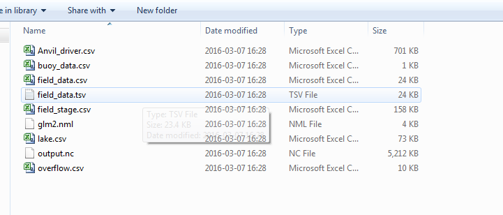

glmtools model inputs: parameters
========================================================
type:prompt
left: 60%
<div style="text-align: center; width: 100%;"><span class=large>glmtools Code in R:</span></div>

```r
library(glmtools)
```


```r
nml_file <- file.path(tmp_run_dir, 'glm2.nml')
```


```r
nml <- read_nml(nml_file)
print(nml) 
```

```
&glm_setup
   sim_name = 'GLMSimulation'
   max_layers = 480
   min_layer_vol = 0.025
   min_layer_thick = 0.5
   max_layer_thick = 1.5
   Kw = 0.55
   coef_mix_conv = 0.125
   coef_wind_stir = 0.23
   coef_mix_shear = 0.2
   coef_mix_turb = 0.51
   coef_mix_KH = 0.3
   coef_mix_hyp = 0.5
/
&morphometry
   lake_name = 'Anvil'
   latitude = 32
   longitude = 35
   bsn_len = 21000
   bsn_wid = 13000
   bsn_vals = 15
   H = 510.5363, 511.23299, 511.92967, 512.62636, 513.32304, 514.01973, 514.71641, 515.4131, 516.10979, 516.80647, 517.50316, 518.19984, 518.89653, 519.59321, 520.2899
   A = 0, 108964, 217929, 326893, 435858, 544822.5, 653787, 762751, 871716, 980680, 1089645, 1198609, 1307574, 1416538, 1525503
/
&time
   timefmt = 2
   start = '2011-04-01 00:00:00'
   stop = '2011-09-02 00:00:00'
   dt = 3600
   timezone = 7
/
&output
   out_dir = '.'
   out_fn = 'output'
   nsave = 24
   csv_lake_fname = 'lake'
   csv_point_nlevs = 0
   csv_point_fname = 'WQ_'
   csv_point_at = 17
   csv_point_nvars = 2
   csv_point_vars = 'temp','salt','OXY_oxy'
   csv_outlet_allinone = .false.
   csv_outlet_fname = 'outlet_'
   csv_outlet_nvars = 3
   csv_outlet_vars = 'flow','temp','salt','OXY_oxy'
   csv_ovrflw_fname = 'overflow'
/
&init_profiles
   lake_depth = 9.7536
   num_depths = 3
   the_depths = 0, 1.2, 9.7536
   the_temps = 12, 10, 7
   the_sals = 0, 0, 0
   num_wq_vars = 6
   wq_names = 'OGM_don','OGM_pon','OGM_dop','OGM_pop','OGM_doc','OGM_poc'
   wq_init_vals = 1.1, 1.2, 1.3, 1.2, 1.3, 2.1, 2.2, 2.3, 1.2, 1.3, 3.1, 3.2, 3.3, 1.2, 1.3, 4.1, 4.2, 4.3, 1.2, 1.3, 5.1, 5.2, 5.3, 1.2, 1.3, 6.1, 6.2, 6.3, 1.2, 1.3
/
&meteorology
   met_sw = .true.
   lw_type = 'LW_IN'
   rain_sw = .false.
   snow_sw = .false.
   atm_stab = .false.
   catchrain = .false.
   rad_mode = 1
   albedo_mode = 1
   cloud_mode = 4
   subdaily = .false.
   meteo_fl = 'Anvil_driver.csv'
   wind_factor = 1
   sw_factor = 1
   lw_factor = 1
   at_factor = 1
   rh_factor = 1
   rain_factor = 1
   ce = 0.0013
   ch = 0.0013
   cd = 0.00108
   rain_threshold = 0.01
   runoff_coef = 0.3
/
&bird_model
   AP = 973
   Oz = 0.279
   WatVap = 1.1
   AOD500 = 0.033
   AOD380 = 0.038
   Albedo = 0.2
/
&inflow
   num_inflows = 0
   names_of_strms = 'Riv1','Riv2'
   subm_flag = .false.
   strm_hf_angle = 65, 65
   strmbd_slope = 2, 2
   strmbd_drag = 0.016, 0.016
   inflow_factor = 1, 1
   inflow_fl = 'inflow_1.csv','inflow_2.csv'
   inflow_varnum = 4
   inflow_vars = 'FLOW','TEMP','SALT','OXY_oxy','SIL_rsi','NIT_amm','NIT_nit','PHS_frp','OGM_don','OGM_pon','OGM_dop','OGM_pop','OGM_doc','OGM_poc','PHY_green','PHY_crypto','PHY_diatom'
/
&outflow
   num_outlet = 0
   flt_off_sw = .false.
   outl_elvs = -215.5
   bsn_len_outl = 799
   bsn_wid_outl = 399
   outflow_fl = 'outflow.csv'
   outflow_factor = 0.8
/
&snowice
   snow_albedo_factor = 1
   snow_rho_max = 300
   snow_rho_min = 50
/
&sed_heat
   sed_temp_mean = 9.7
   sed_temp_amplitude = 2.7
   sed_temp_peak_doy = 242.5
/
```
***
<div style="text-align: left; width: 100%;"><span class=large>   Explanation</span></div>

 - load glmtools  
 
 - specify location of glm.nml file  
 
 - read glm.nml file into R  
 
 - print (view) the contents of the nml file


glmtools model inputs: parameters
========================================================
type:prompt
left: 60%
<div style="text-align: center; width: 100%;"><span class=large>glmtools Code in R:</span></div>

```r
get_nml_value(nml,'sim_name')
```

```
[1] "GLMSimulation"
```

```r
get_nml_value(nml,'Kw')
```

```
[1] 0.55
```
***
<div style="text-align: left; width: 100%;"><span class=large>   Explanation</span></div>

 - get values for specific parameters 

glmtools model inputs: meteorological drivers
========================================================
type:prompt
left: 60%
<div style="text-align: center; width: 100%;"><span class=large>glmtools Code in R:</span></div>


```r
plot_meteo(nml_file)
```

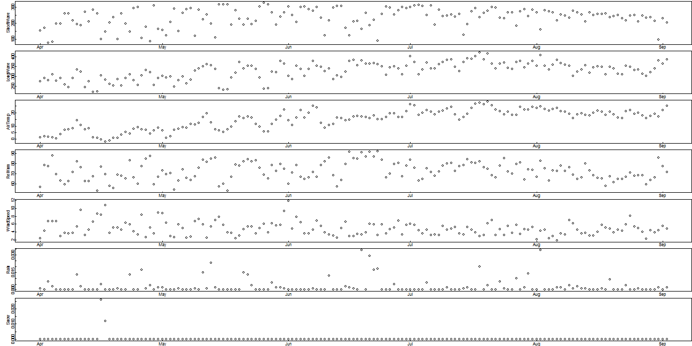
***
<div style="text-align: left; width: 100%;"><span class=large>   Explanation</span></div>
 - plot meteorological drivers for simulation
 

glmtools run model
========================================================
type:prompt
left: 60%
<div style="text-align: center; width: 100%;"><span class=large>glmtools Code in R:</span></div>

```r
basename(tmp_run_dir)
```

```
[1] "glm_egs"
```

```r
run_glm(tmp_run_dir)
```

```
[1] 0
```
***
<div style="text-align: left; width: 100%;"><span class=large>   Explanation</span></div>
 - set simulation folder for GLM  
 
 - run GLM model
 
glmtools visualize results
========================================================
type:prompt
left: 60%
<div style="text-align: center; width: 100%;"><span class=large>glmtools Code in R:</span></div>


```r
nc_file <- file.path(tmp_run_dir,'output.nc')
```

```r
plot_temp(file = nc_file, fig_path = FALSE)
```

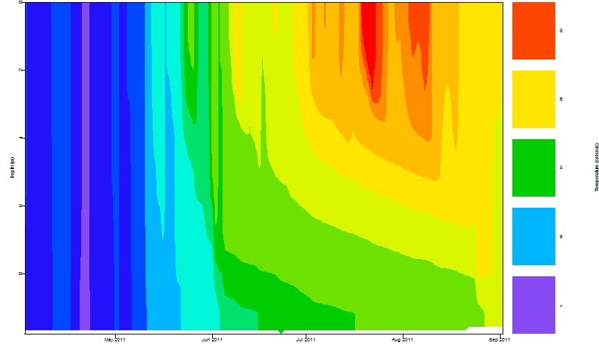
***
<div style="text-align: left; width: 100%;"><span class=large>   Explanation</span></div>
 - set output results file  
 
 - plot water temperatures
 
glmtools section 2
========================================================
id: section2
type:sub-section 
<span class=large>**Goals**
 - **validate/evaluate model outputs**
 - **modify model parameters**  
 - **run simulation with modified parameters**
 </span>
 

glmtools: modify model parameters
========================================================
type:prompt
left: 60%
<div style="text-align: center; width: 100%;"><span class=large>glmtools Code in R:</span></div>

```r
nml <- set_nml(nml, arg_name = 'Kw', 
          arg_val = 1.05)
```

```r
print(nml)
```

```
&glm_setup
   sim_name = 'GLMSimulation'
   max_layers = 480
   min_layer_vol = 0.025
   min_layer_thick = 0.5
   max_layer_thick = 1.5
   Kw = 1.05
   coef_mix_conv = 0.125
   coef_wind_stir = 0.23
   coef_mix_shear = 0.2
   coef_mix_turb = 0.51
   coef_mix_KH = 0.3
   coef_mix_hyp = 0.5
/
&morphometry
   lake_name = 'Anvil'
   latitude = 32
   longitude = 35
   bsn_len = 21000
   bsn_wid = 13000
   bsn_vals = 15
   H = 510.5363, 511.23299, 511.92967, 512.62636, 513.32304, 514.01973, 514.71641, 515.4131, 516.10979, 516.80647, 517.50316, 518.19984, 518.89653, 519.59321, 520.2899
   A = 0, 108964, 217929, 326893, 435858, 544822.5, 653787, 762751, 871716, 980680, 1089645, 1198609, 1307574, 1416538, 1525503
/
&time
   timefmt = 2
   start = '2011-04-01 00:00:00'
   stop = '2011-09-02 00:00:00'
   dt = 3600
   timezone = 7
/
&output
   out_dir = '.'
   out_fn = 'output'
   nsave = 24
   csv_lake_fname = 'lake'
   csv_point_nlevs = 0
   csv_point_fname = 'WQ_'
   csv_point_at = 17
   csv_point_nvars = 2
   csv_point_vars = 'temp','salt','OXY_oxy'
   csv_outlet_allinone = .false.
   csv_outlet_fname = 'outlet_'
   csv_outlet_nvars = 3
   csv_outlet_vars = 'flow','temp','salt','OXY_oxy'
   csv_ovrflw_fname = 'overflow'
/
&init_profiles
   lake_depth = 9.7536
   num_depths = 3
   the_depths = 0, 1.2, 9.7536
   the_temps = 12, 10, 7
   the_sals = 0, 0, 0
   num_wq_vars = 6
   wq_names = 'OGM_don','OGM_pon','OGM_dop','OGM_pop','OGM_doc','OGM_poc'
   wq_init_vals = 1.1, 1.2, 1.3, 1.2, 1.3, 2.1, 2.2, 2.3, 1.2, 1.3, 3.1, 3.2, 3.3, 1.2, 1.3, 4.1, 4.2, 4.3, 1.2, 1.3, 5.1, 5.2, 5.3, 1.2, 1.3, 6.1, 6.2, 6.3, 1.2, 1.3
/
&meteorology
   met_sw = .true.
   lw_type = 'LW_IN'
   rain_sw = .false.
   snow_sw = .false.
   atm_stab = .false.
   catchrain = .false.
   rad_mode = 1
   albedo_mode = 1
   cloud_mode = 4
   subdaily = .false.
   meteo_fl = 'Anvil_driver.csv'
   wind_factor = 1
   sw_factor = 1
   lw_factor = 1
   at_factor = 1
   rh_factor = 1
   rain_factor = 1
   ce = 0.0013
   ch = 0.0013
   cd = 0.00108
   rain_threshold = 0.01
   runoff_coef = 0.3
/
&bird_model
   AP = 973
   Oz = 0.279
   WatVap = 1.1
   AOD500 = 0.033
   AOD380 = 0.038
   Albedo = 0.2
/
&inflow
   num_inflows = 0
   names_of_strms = 'Riv1','Riv2'
   subm_flag = .false.
   strm_hf_angle = 65, 65
   strmbd_slope = 2, 2
   strmbd_drag = 0.016, 0.016
   inflow_factor = 1, 1
   inflow_fl = 'inflow_1.csv','inflow_2.csv'
   inflow_varnum = 4
   inflow_vars = 'FLOW','TEMP','SALT','OXY_oxy','SIL_rsi','NIT_amm','NIT_nit','PHS_frp','OGM_don','OGM_pon','OGM_dop','OGM_pop','OGM_doc','OGM_poc','PHY_green','PHY_crypto','PHY_diatom'
/
&outflow
   num_outlet = 0
   flt_off_sw = .false.
   outl_elvs = -215.5
   bsn_len_outl = 799
   bsn_wid_outl = 399
   outflow_fl = 'outflow.csv'
   outflow_factor = 0.8
/
&snowice
   snow_albedo_factor = 1
   snow_rho_max = 300
   snow_rho_min = 50
/
&sed_heat
   sed_temp_mean = 9.7
   sed_temp_amplitude = 2.7
   sed_temp_peak_doy = 242.5
/
```
***
<div style="text-align: left; width: 100%;"><span class=large>   Explanation</span></div>
 - change parameter value  
</br>
 - view nml with change
 
glmtools: re-run simulation
========================================================
type:prompt
left: 60%
<div style="text-align: center; width: 100%;"><span class=large>glmtools Code in R:</span></div>

```r
write_nml(glm_nml = nml, file = nml_file)
```

```r
run_glm(tmp_run_dir)
```

```
[1] 0
```
***
<div style="text-align: left; width: 100%;"><span class=large>   Explanation</span></div>
 - write changed glm.nml to file  
 
 - run GLM model


glmtools: visualize result
========================================================
type:prompt
left: 60%
<div style="text-align: center; width: 100%;"><span class=large>glmtools Code in R:</span></div>

```r
nc_file <- file.path(tmp_run_dir,'output.nc')
```

```r
plot_temp(file = nc_file, fig_path = FALSE)
```

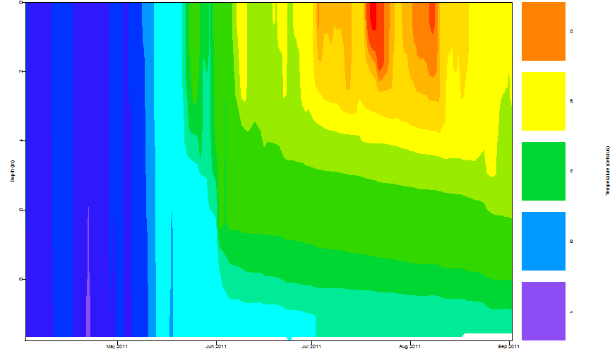
***
<div style="text-align: left; width: 100%;"><span class=large>   Explanation</span></div>
 - double check nc_file path
 
 - quickly visualize new temps
